# 🚀 100 Days of Machine Learning — Challenge

Welcome to my **100 Days of Machine Learning Challenge** repository! This repo documents my daily ML practice — notebooks, mini projects, and output screenshots — built one day at a time.

| | |
|---|---|
| 📅 **Start Date** | 01 May 2026 |
| 🏁 **End Date** | 08 August 2026 |
| 📌 **Focus** | Python, ML algorithms, EDA, model building & evaluation |
| 📸 **Proof** | Notebook + output screenshot for each day |

The goal of this challenge is to strengthen:
- Machine Learning concepts
- Python implementation skills
- Data preprocessing techniques
- Model building & evaluation
- Real-world project experience

---

## 📅 Daily Progress

## Day 1 - 01 May 2026
### 🔹 Jupyter Notebook
[Open Notebook](Jupyter_Notebook/2026-05-01_ML_001.ipynb)
### 🔹 Output Screenshot
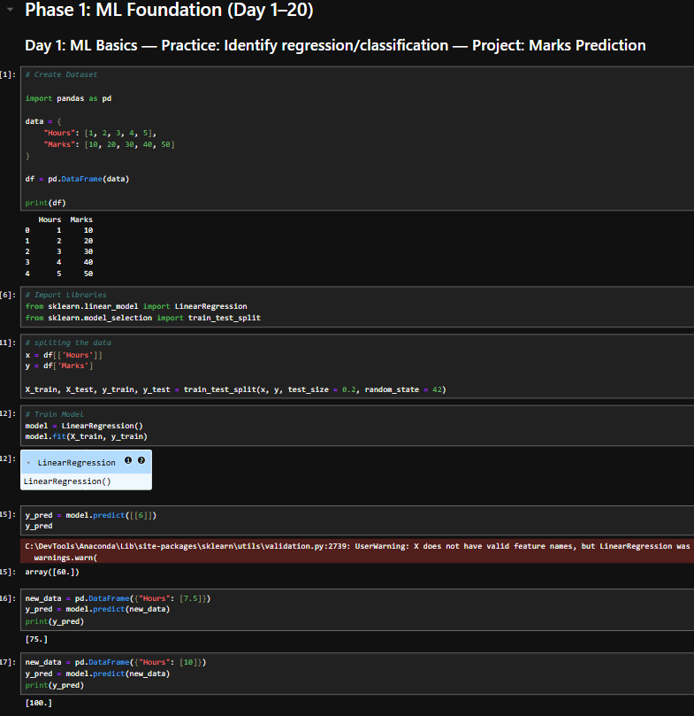

---

## Day 2 - 02 May 2026
### 🔹 Jupyter Notebook
[Open Notebook](Jupyter_Notebook/2026-05-02_ML_002.ipynb)
### 🔹 Output Screenshot
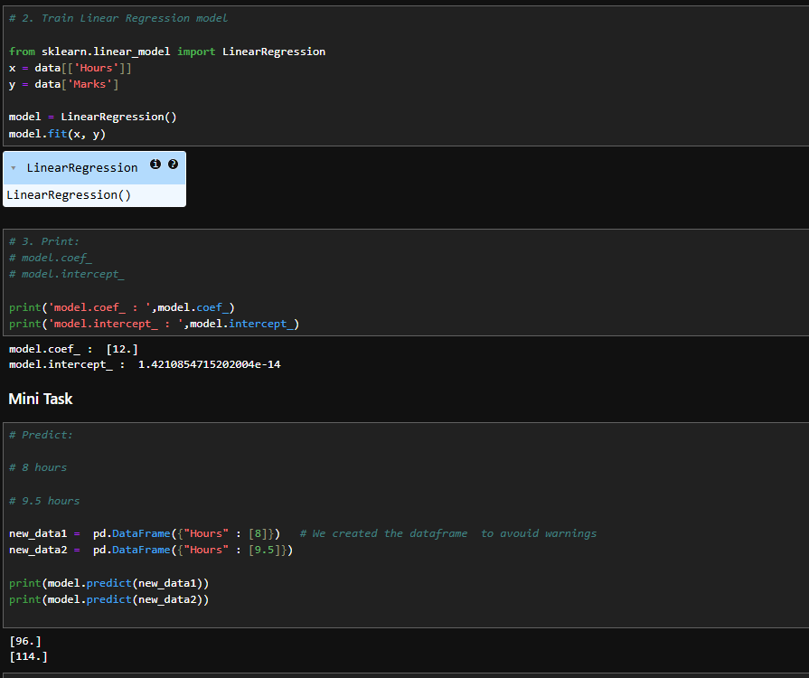

---

## Day 3 - 03 May 2026
### 🔹 Jupyter Notebook
[Open Notebook](Jupyter_Notebook/2026-05-03_ML_003.ipynb)
### 🔹 Output Screenshot
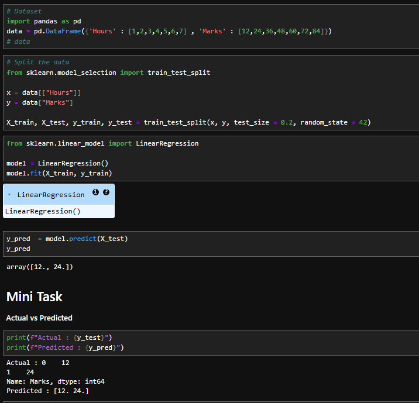

---

## Day 4 - 04 May 2026
### 🔹 Jupyter Notebook
[Open Notebook](Jupyter_Notebook/2026-05-04_ML_004.ipynb)
### 🔹 Output Screenshot
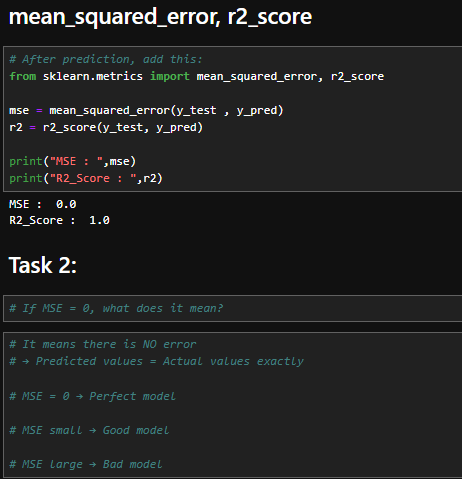

---

## Day 5 - 05 May 2026
### 🔹 Jupyter Notebook
[Open Notebook](Jupyter_Notebook/2026-05-05_ML_005.ipynb)
### 🔹 Output Screenshot
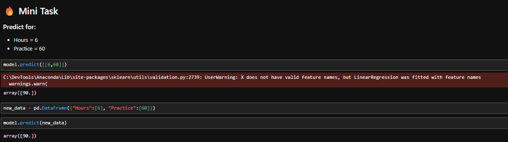

---

## Day 6 - 06 May 2026
### 🔹 Jupyter Notebook
[Open Notebook](Jupyter_Notebook/2026-05-06_ML_006.ipynb)
### 🔹 Output Screenshot
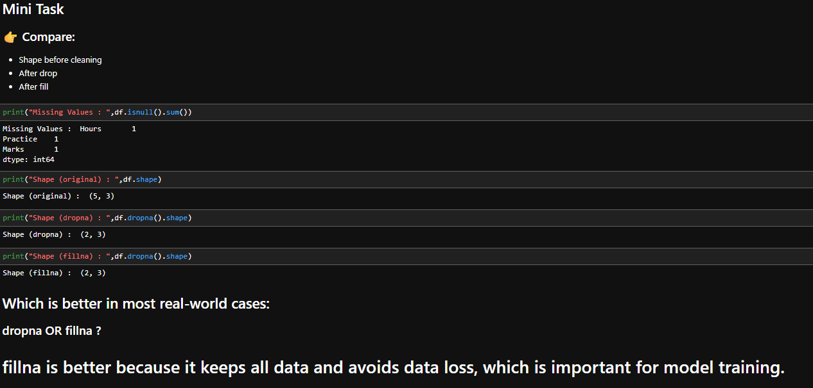

---

## Day 7 - 07 May 2026
### 🔹 Jupyter Notebook
[Open Notebook](Jupyter_Notebook/2026-05-07_ML_007.ipynb)
### 🔹 Output Screenshot
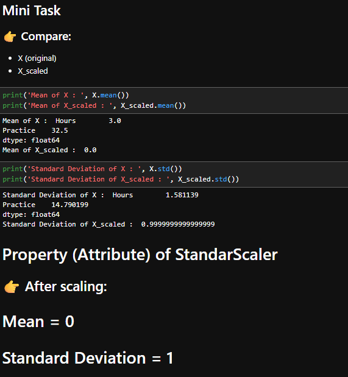

---

## Day 8 - 08 May 2026
### 🔹 Jupyter Notebook
[Open Notebook](Jupyter_Notebook/2026-05-08_ML_008.ipynb)
### 🔹 Output Screenshot
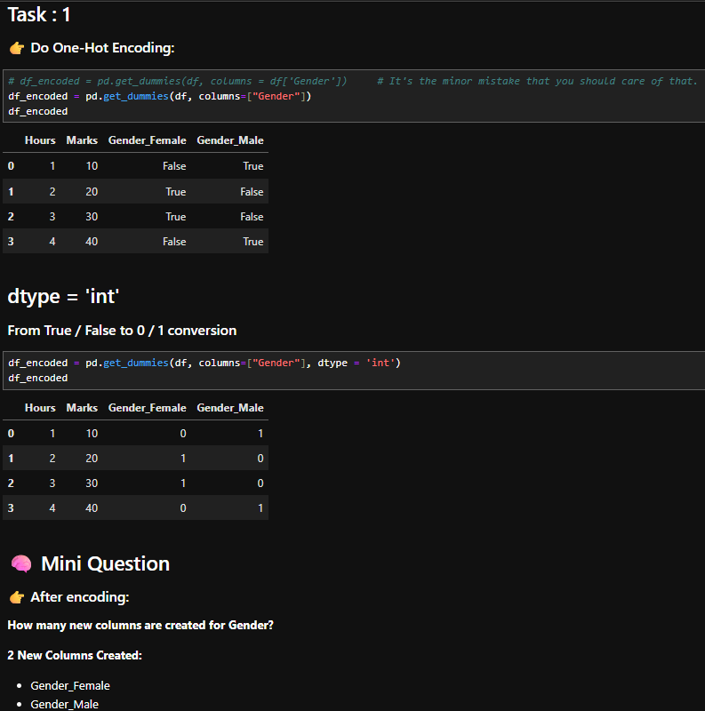

---

## Day 9 - 09 May 2026
### 🔹 Jupyter Notebook
[Open Notebook](Jupyter_Notebook/2026-05-09_ML_009.ipynb)
### 🔹 Output Screenshot
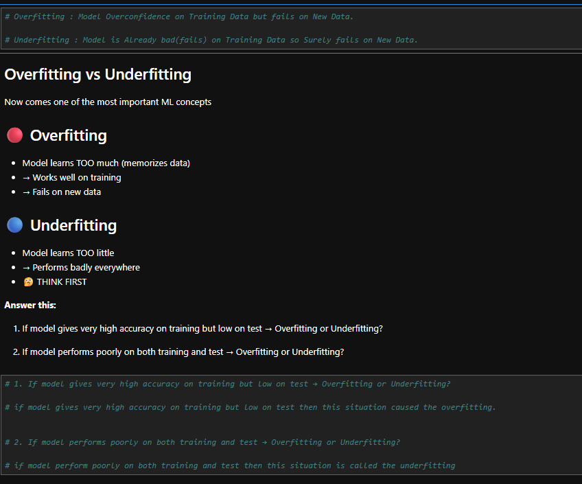

---

## Day 10 - 10 May 2026
### 🔹 Jupyter Notebook
[Open Notebook](Jupyter_Notebook/2026-05-10_ML_010.ipynb)
### 🔹 Output Screenshot
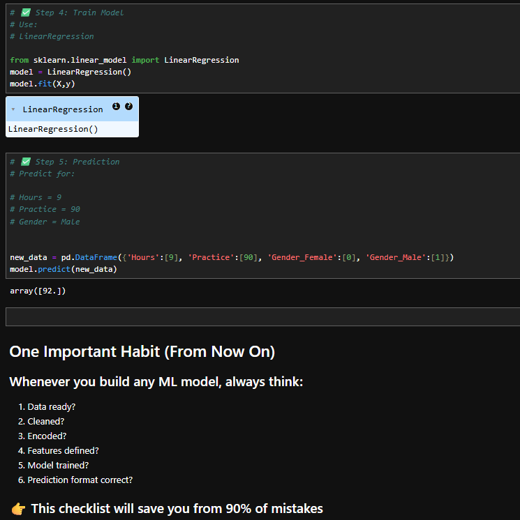

---

## Day 11 - 11 May 2026
### 🔹 Jupyter Notebook
[Open Notebook](Jupyter_Notebook/2026-05-11_ML_011.ipynb)
### 🔹 Output Screenshot
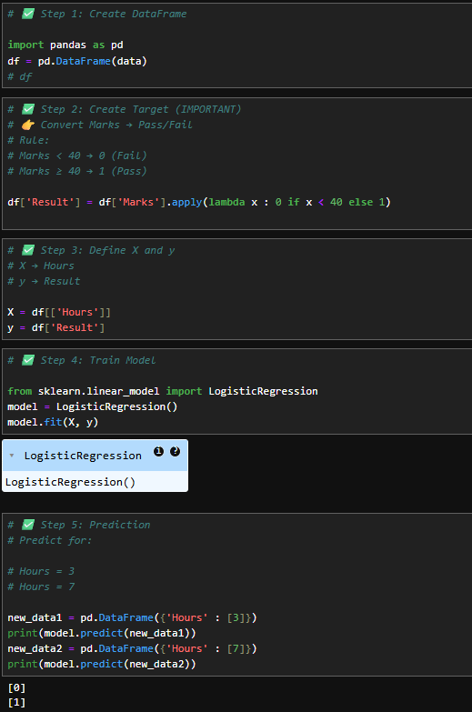

---

## Day 12 - 12 May 2026
### 🔹 Jupyter Notebook
[Open Notebook](Jupyter_Notebook/2026-05-12_ML_012.ipynb)
### 🔹 Output Screenshot
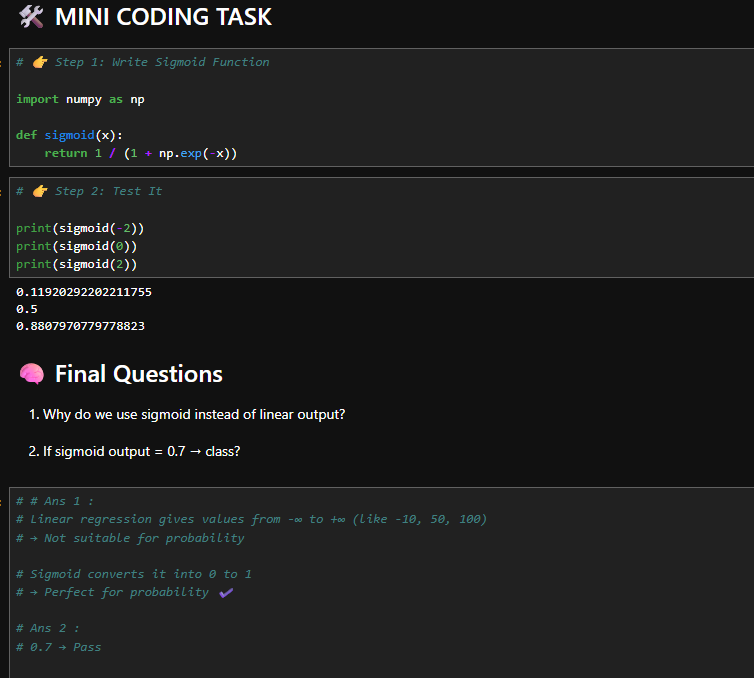

---

## Day 13 - 13 May 2026
### 🔹 Jupyter Notebook
[Open Notebook](Jupyter_Notebook/2026-05-13_ML_013.ipynb)
### 🔹 Output Screenshot
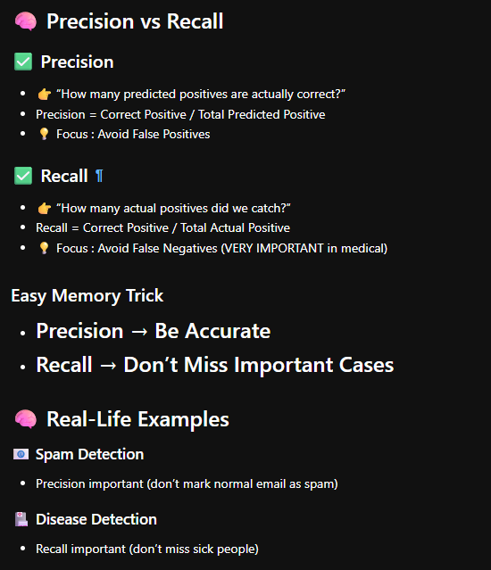

---

## Day 14 - 14 May 2026
### 🔹 Jupyter Notebook
[Open Notebook](Jupyter_Notebook/2026-05-14_ML_014.ipynb)
### 🔹 Output Screenshot
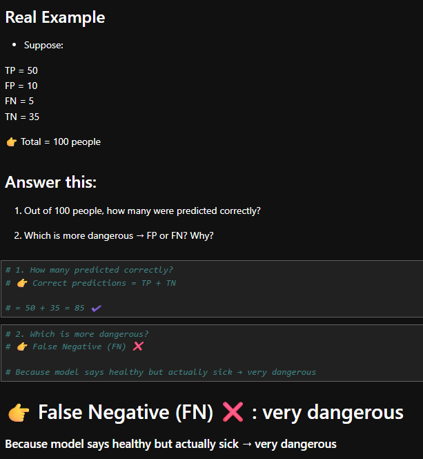

---

## Day 15 - 15 May 2026
### 🔹 Jupyter Notebook
[Open Notebook](Jupyter_Notebook/2026-05-15_ML_015.ipynb)
### 🔹 Output Screenshot
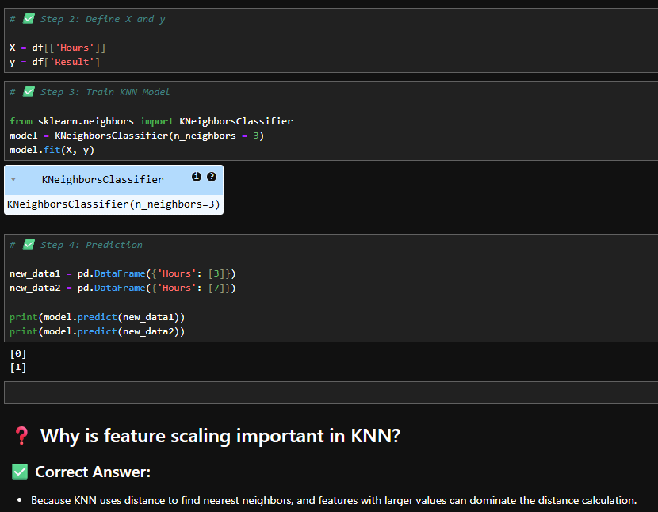

---

## Day 16 - 16 May 2026
### 🔹 Jupyter Notebook
[Open Notebook](Jupyter_Notebook/2026-05-16_ML_016.ipynb)
### 🔹 Output Screenshot
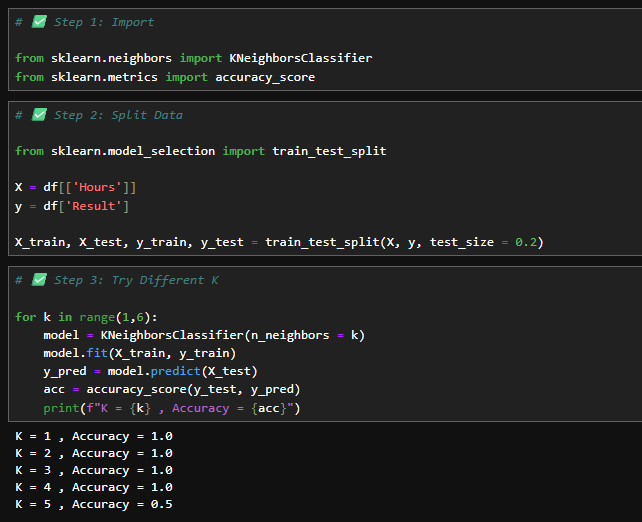

---

## Day 17 - 17 May 2026
### 🔹 Jupyter Notebook
[Open Notebook](Jupyter_Notebook/2026-05-17_ML_017.ipynb)
### 🔹 Output Screenshot
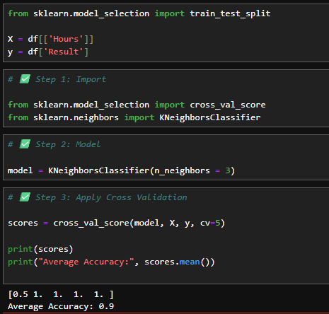

---

## Day 18 - 18 May 2026
### 🔹 Jupyter Notebook
[Open Notebook](Jupyter_Notebook/2026-05-18_ML_018.ipynb)
### 🔹 Output Screenshot
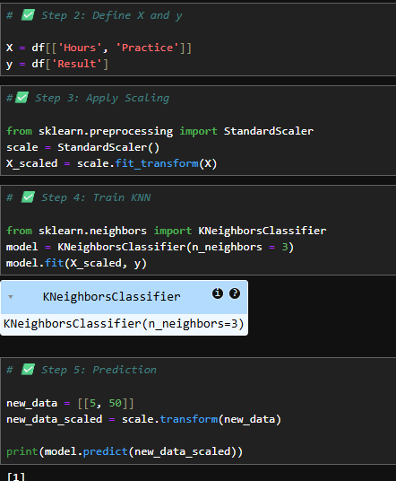

---

## Day 19 - 19 May 2026
### 🔹 Jupyter Notebook
[Open Notebook](Jupyter_Notebook/2026-05-19_ML_019.ipynb)
### 🔹 Output Screenshot
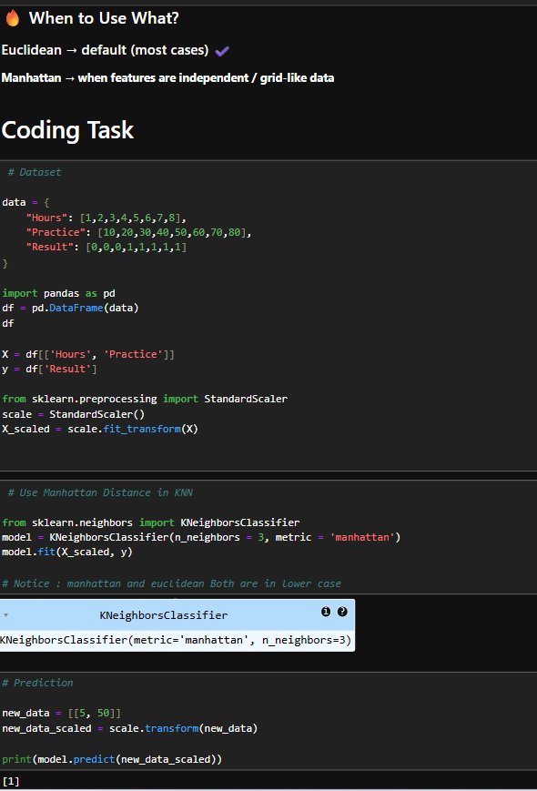

---

## Day 20 - 20 May 2026
### 🔹 Jupyter Notebook
[Open Notebook](Jupyter_Notebook/2026-05-20_ML_020.ipynb)
### 🔹 Output Screenshot
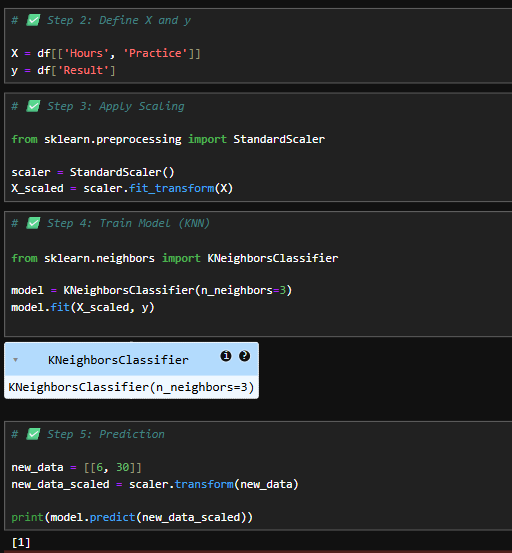

---

## Day 21 - 21 May 2026
### 🔹 Jupyter Notebook
[Open Notebook](Jupyter_Notebook/2026-05-21_ML_021.ipynb)
### 🔹 Output Screenshot
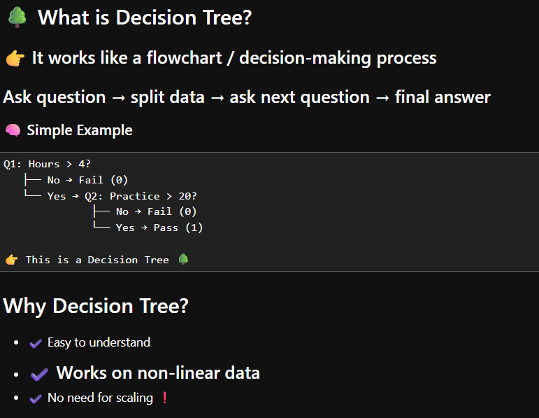

---

## Day 22 - 22 May 2026
### 🔹 Jupyter Notebook
[Open Notebook](Jupyter_Notebook/2026-05-22_ML_022.ipynb)
### 🔹 Output Screenshot
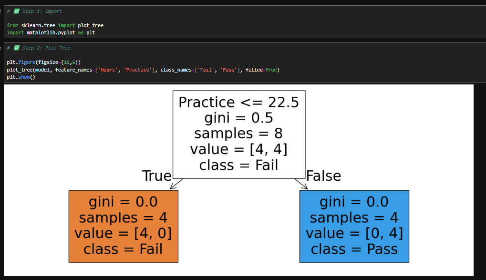

---

## Day 23 - 23 May 2026
### 🔹 Jupyter Notebook
[Open Notebook](Jupyter_Notebook/2026-05-23_ML_023.ipynb)
### 🔹 Output Screenshot
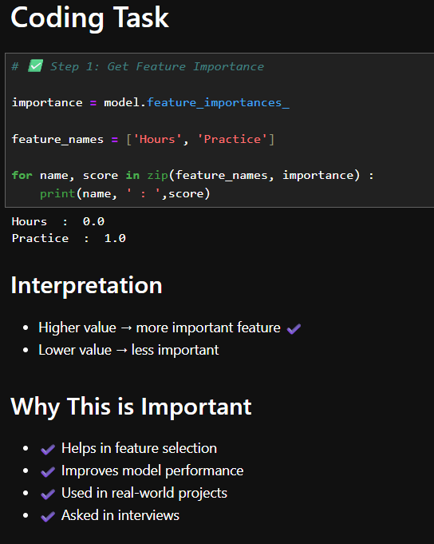

---

## Day 24 - 24 May 2026
### 🔹 Jupyter Notebook
[Open Notebook](Jupyter_Notebook/2026-05-24_ML_024.ipynb)
### 🔹 Output Screenshot
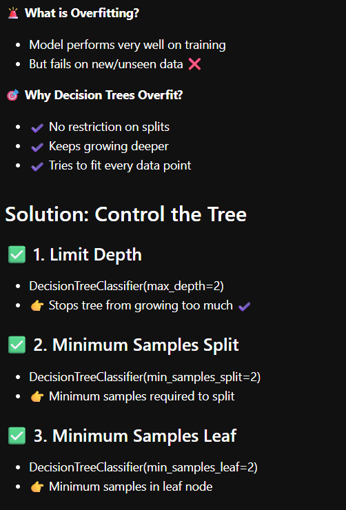

---

## Day 25 - 25 May 2026
### 🔹 Jupyter Notebook
[Open Notebook](Jupyter_Notebook/2026-05-25_ML_025.ipynb)
### 🔹 Output Screenshot
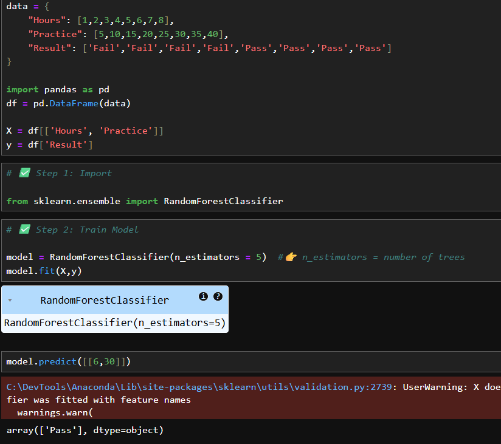

---

## Day 26 - 26 May 2026
### 🔹 Jupyter Notebook
[Open Notebook](Jupyter_Notebook/2026-05-26_ML_026.ipynb)
### 🔹 Output Screenshot
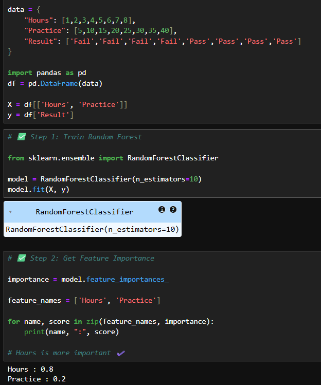

---

## Day 27 - 27 May 2026
### 🔹 Jupyter Notebook
[Open Notebook](Jupyter_Notebook/2026-05-27_ML_027.ipynb)
### 🔹 Output Screenshot
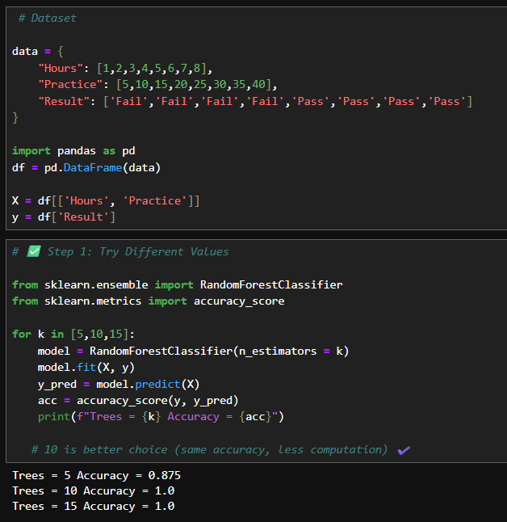

---

## Day 28 - 28 May 2026
### 🔹 Jupyter Notebook
[Open Notebook](Jupyter_Notebook/2026-05-28_ML_028.ipynb)
### 🔹 Output Screenshot
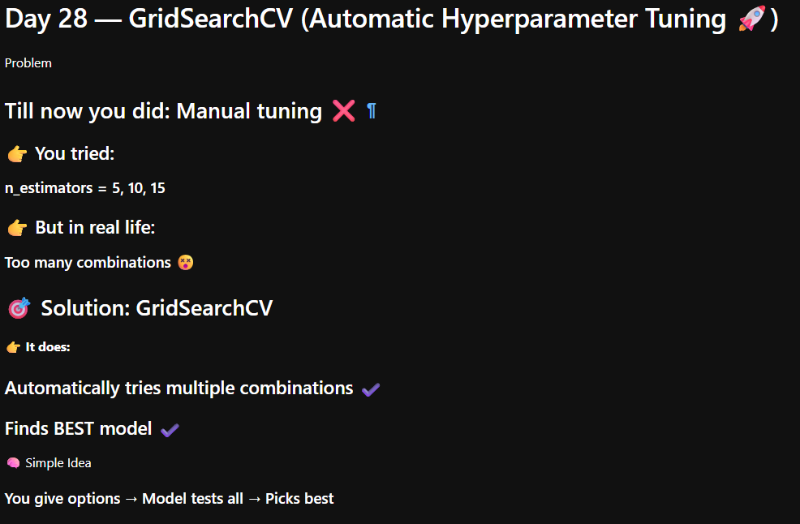

---

## Day 29 - 29 May 2026
### 🔹 Jupyter Notebook
[Open Notebook](Jupyter_Notebook/2026-05-29_ML_029.ipynb)
### 🔹 Output Screenshot
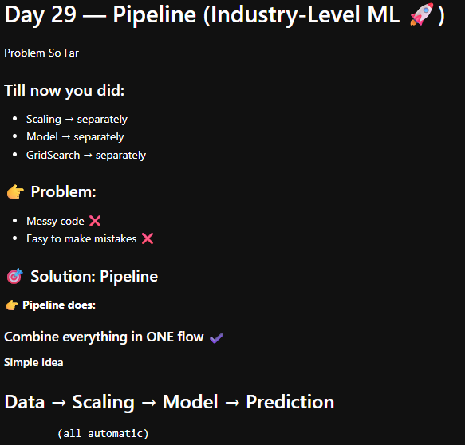

---

## Day 30 - 30 May 2026
### 🔹 Jupyter Notebook
[Open Notebook](Jupyter_Notebook/2026-05-30_ML_030.ipynb)
### 🔹 Output Screenshot
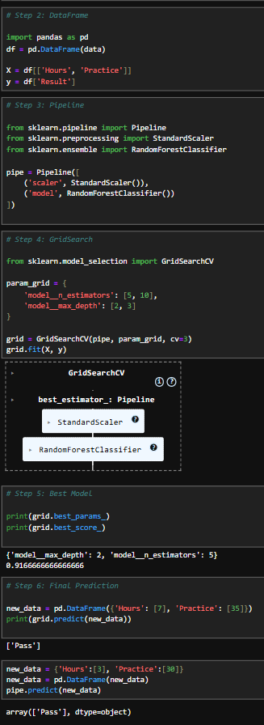

---

## Day 31 - 31 May 2026
### 🔹 Jupyter Notebook
[Open Notebook](Jupyter_Notebook/2026-05-31_ML_031.ipynb)
### 🔹 Output Screenshot
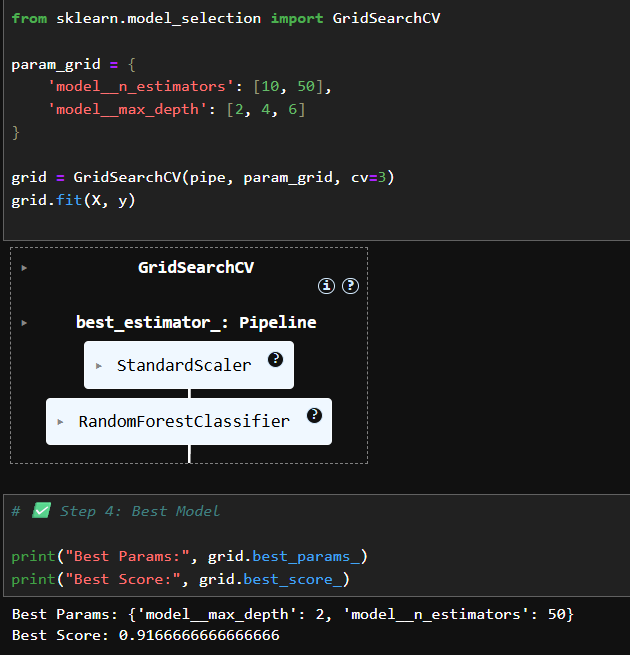

---

## Day 32 - 01 June 2026
### 🔹 Jupyter Notebook
[Open Notebook](Jupyter_Notebook/2026-06-01_ML_032.ipynb)
### 🔹 Output Screenshot
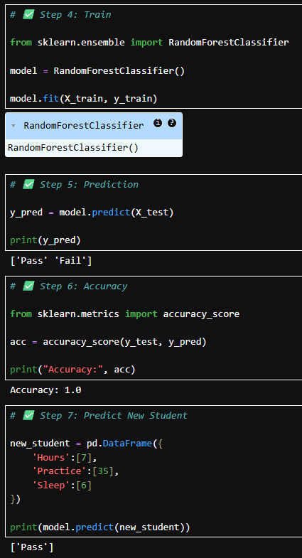

---

## Day 33 - 02 June 2026
### 🔹 Jupyter Notebook
[Open Notebook](Jupyter_Notebook/2026-06-02_ML_033.ipynb)
### 🔹 Output Screenshot
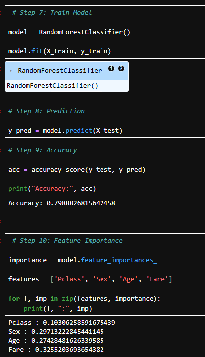

---

## Day 34 - 03 June 2026
### 🔹 Jupyter Notebook
[Open Notebook](Jupyter_Notebook/2026-06-03_ML_034.ipynb)
### 🔹 Output Screenshot
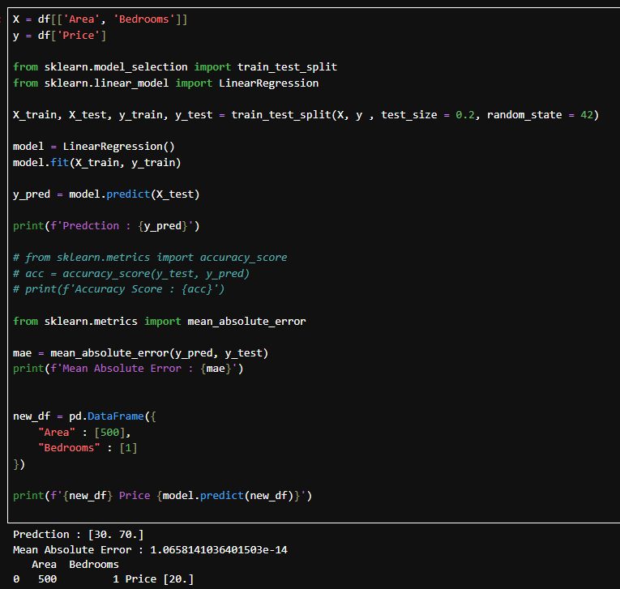

---

## Day 35 - 04 June 2026
### 🔹 Jupyter Notebook
[Open Notebook](Jupyter_Notebook/2026-06-04_ML_035.ipynb)
### 🔹 Output Screenshot

---

## Day 36 - 05 June 2026
### 🔹 Jupyter Notebook
[Open Notebook](Jupyter_Notebook/2026-06-05_ML_036.ipynb)
### 🔹 Output Screenshot

---

## Day 37 - 06 June 2026
### 🔹 Jupyter Notebook
[Open Notebook](Jupyter_Notebook/2026-06-06_ML_037.ipynb)
### 🔹 Output Screenshot

---

## Day 38 - 07 June 2026
### 🔹 Jupyter Notebook
[Open Notebook](Jupyter_Notebook/2026-06-07_ML_038.ipynb)
### 🔹 Output Screenshot

---

## Day 39 - 08 June 2026
### 🔹 Jupyter Notebook
[Open Notebook](Jupyter_Notebook/2026-06-08_ML_039.ipynb)
### 🔹 Output Screenshot

---

## Day 40 - 09 June 2026
### 🔹 Jupyter Notebook
[Open Notebook](Jupyter_Notebook/2026-06-09_ML_040.ipynb)
### 🔹 Output Screenshot

---

## Day 41 - 10 June 2026
### 🔹 Jupyter Notebook
[Open Notebook](Jupyter_Notebook/2026-06-10_ML_041.ipynb)
### 🔹 Output Screenshot

---

## Day 42 - 11 June 2026
### 🔹 Jupyter Notebook
[Open Notebook](Jupyter_Notebook/2026-06-11_ML_042.ipynb)
### 🔹 Output Screenshot

---

## Day 43 - 12 June 2026
### 🔹 Jupyter Notebook
[Open Notebook](Jupyter_Notebook/2026-06-12_ML_043.ipynb)
### 🔹 Output Screenshot

---

## Day 44 - 13 June 2026
### 🔹 Jupyter Notebook
[Open Notebook](Jupyter_Notebook/2026-06-13_ML_044.ipynb)
### 🔹 Output Screenshot

---

## Day 45 - 14 June 2026
### 🔹 Jupyter Notebook
[Open Notebook](Jupyter_Notebook/2026-06-14_ML_045.ipynb)
### 🔹 Output Screenshot

---

## Day 46 - 15 June 2026
### 🔹 Jupyter Notebook
[Open Notebook](Jupyter_Notebook/2026-06-15_ML_046.ipynb)
### 🔹 Output Screenshot

---

## Day 47 - 16 June 2026
### 🔹 Jupyter Notebook
[Open Notebook](Jupyter_Notebook/2026-06-16_ML_047.ipynb)
### 🔹 Output Screenshot

---

## Day 48 - 17 June 2026
### 🔹 Jupyter Notebook
[Open Notebook](Jupyter_Notebook/2026-06-17_ML_048.ipynb)
### 🔹 Output Screenshot

---

## Day 49 - 18 June 2026
### 🔹 Jupyter Notebook
[Open Notebook](Jupyter_Notebook/2026-06-18_ML_049.ipynb)
### 🔹 Output Screenshot

---

## Day 50 - 19 June 2026
### 🔹 Jupyter Notebook
[Open Notebook](Jupyter_Notebook/2026-06-19_ML_050.ipynb)
### 🔹 Output Screenshot

---

## Day 51 - 20 June 2026
### 🔹 Jupyter Notebook
[Open Notebook](Jupyter_Notebook/2026-06-20_ML_051.ipynb)
### 🔹 Output Screenshot

---

## Day 52 - 21 June 2026
### 🔹 Jupyter Notebook
[Open Notebook](Jupyter_Notebook/2026-06-21_ML_052.ipynb)
### 🔹 Output Screenshot

---

## Day 53 - 22 June 2026
### 🔹 Jupyter Notebook
[Open Notebook](Jupyter_Notebook/2026-06-22_ML_053.ipynb)
### 🔹 Output Screenshot

---

## Day 54 - 23 June 2026
### 🔹 Jupyter Notebook
[Open Notebook](Jupyter_Notebook/2026-06-23_ML_054.ipynb)
### 🔹 Output Screenshot

---

## Day 55 - 24 June 2026
### 🔹 Jupyter Notebook
[Open Notebook](Jupyter_Notebook/2026-06-24_ML_055.ipynb)
### 🔹 Output Screenshot

---

## Day 56 - 25 June 2026
### 🔹 Jupyter Notebook
[Open Notebook](Jupyter_Notebook/2026-06-25_ML_056.ipynb)
### 🔹 Output Screenshot
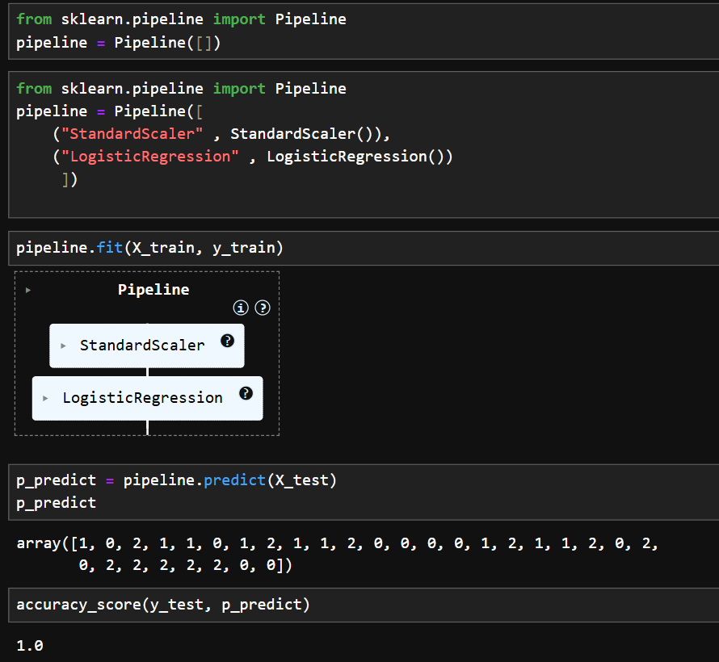

---

## Day 57 - 26 June 2026
### 🔹 Jupyter Notebook
[Open Notebook](Jupyter_Notebook/2026-06-26_ML_057.ipynb)
### 🔹 Output Screenshot
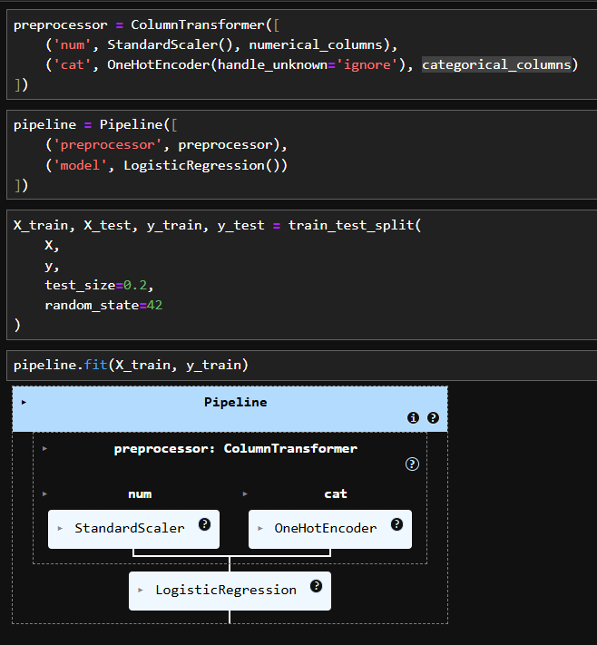

---

## Day 58 - 27 June 2026
### 🔹 Jupyter Notebook
[Open Notebook](Jupyter_Notebook/2026-06-27_ML_058.ipynb)
### 🔹 Output Screenshot
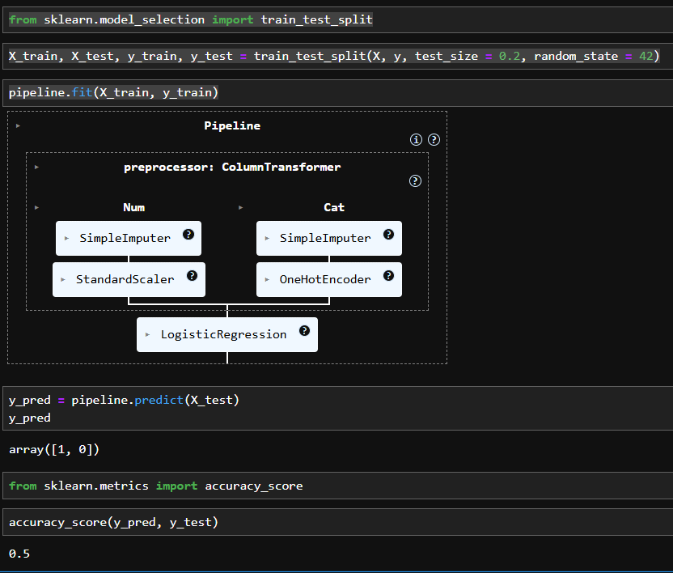

---

## Day 59 - 28 June 2026
### 🔹 Jupyter Notebook
[Open Notebook](Jupyter_Notebook/2026-06-28_ML_059.ipynb)
### 🔹 Output Screenshot

---

## Day 60 - 29 June 2026
### 🔹 Jupyter Notebook
[Open Notebook](Jupyter_Notebook/2026-06-29_ML_060.ipynb)
### 🔹 Output Screenshot

---

## Day 61 - 30 June 2026
### 🔹 Jupyter Notebook
[Open Notebook](Jupyter_Notebook/2026-06-30_ML_061.ipynb)
### 🔹 Output Screenshot

---

## Day 62 - 01 July 2026
### 🔹 Jupyter Notebook
[Open Notebook](Jupyter_Notebook/2026-07-01_ML_062.ipynb)
### 🔹 Output Screenshot

---

## Day 63 - 02 July 2026
### 🔹 Jupyter Notebook
[Open Notebook](Jupyter_Notebook/2026-07-02_ML_063.ipynb)
### 🔹 Output Screenshot

---

## Day 64 - 03 July 2026
### 🔹 Jupyter Notebook
[Open Notebook](Jupyter_Notebook/2026-07-03_ML_064.ipynb)
### 🔹 Output Screenshot

---

## Day 65 - 04 July 2026
### 🔹 Jupyter Notebook
[Open Notebook](Jupyter_Notebook/2026-07-04_ML_065.ipynb)
### 🔹 Output Screenshot

---

## Day 66 - 05 July 2026
### 🔹 Jupyter Notebook
[Open Notebook](Jupyter_Notebook/2026-07-05_ML_066.ipynb)
### 🔹 Output Screenshot

---

## Day 67 - 06 July 2026
### 🔹 Jupyter Notebook
[Open Notebook](Jupyter_Notebook/2026-07-06_ML_067.ipynb)
### 🔹 Output Screenshot

---

## Day 68 - 07 July 2026
### 🔹 Jupyter Notebook
[Open Notebook](Jupyter_Notebook/2026-07-07_ML_068.ipynb)
### 🔹 Output Screenshot

---

## Day 69 - 08 July 2026
### 🔹 Jupyter Notebook
[Open Notebook](Jupyter_Notebook/2026-07-08_ML_069.ipynb)
### 🔹 Output Screenshot

---

## Day 70 - 09 July 2026
### 🔹 Jupyter Notebook
[Open Notebook](Jupyter_Notebook/2026-07-09_ML_070.ipynb)
### 🔹 Output Screenshot

---

## Day 71 - 10 July 2026
### 🔹 Jupyter Notebook
[Open Notebook](Jupyter_Notebook/2026-07-10_ML_071.ipynb)
### 🔹 Output Screenshot

---

## Day 72 - 11 July 2026
### 🔹 Jupyter Notebook
[Open Notebook](Jupyter_Notebook/2026-07-11_ML_072.ipynb)
### 🔹 Output Screenshot

---

## Day 73 - 12 July 2026
### 🔹 Jupyter Notebook
[Open Notebook](Jupyter_Notebook/2026-07-12_ML_073.ipynb)
### 🔹 Output Screenshot

---

## Day 74 - 13 July 2026
### 🔹 Jupyter Notebook
[Open Notebook](Jupyter_Notebook/2026-07-13_ML_074.ipynb)
### 🔹 Output Screenshot

---

## Day 75 - 14 July 2026
### 🔹 Jupyter Notebook
[Open Notebook](Jupyter_Notebook/2026-07-14_ML_075.ipynb)
### 🔹 Output Screenshot

---

## Day 76 - 15 July 2026
### 🔹 Jupyter Notebook
[Open Notebook](Jupyter_Notebook/2026-07-15_ML_076.ipynb)
### 🔹 Output Screenshot

---

## Day 77 - 16 July 2026
### 🔹 Jupyter Notebook
[Open Notebook](Jupyter_Notebook/2026-07-16_ML_077.ipynb)
### 🔹 Output Screenshot

---

## Day 78 - 17 July 2026
### 🔹 Jupyter Notebook
[Open Notebook](Jupyter_Notebook/2026-07-17_ML_078.ipynb)
### 🔹 Output Screenshot

---

## Day 79 - 18 July 2026
### 🔹 Jupyter Notebook
[Open Notebook](Jupyter_Notebook/2026-07-18_ML_079.ipynb)
### 🔹 Output Screenshot

---

## Day 80 - 19 July 2026
### 🔹 Jupyter Notebook
[Open Notebook](Jupyter_Notebook/2026-07-19_ML_080.ipynb)
### 🔹 Output Screenshot

---

## Day 81 - 20 July 2026
### 🔹 Jupyter Notebook
[Open Notebook](Jupyter_Notebook/2026-07-20_ML_081.ipynb)
### 🔹 Output Screenshot

---

## Day 82 - 21 July 2026
### 🔹 Jupyter Notebook
[Open Notebook](Jupyter_Notebook/2026-07-21_ML_082.ipynb)
### 🔹 Output Screenshot

---

## Day 83 - 22 July 2026
### 🔹 Jupyter Notebook
[Open Notebook](Jupyter_Notebook/2026-07-22_ML_083.ipynb)
### 🔹 Output Screenshot

---

## Day 84 - 23 July 2026
### 🔹 Jupyter Notebook
[Open Notebook](Jupyter_Notebook/2026-07-23_ML_084.ipynb)
### 🔹 Output Screenshot

---

## Day 85 - 24 July 2026
### 🔹 Jupyter Notebook
[Open Notebook](Jupyter_Notebook/2026-07-24_ML_085.ipynb)
### 🔹 Output Screenshot

---

## Day 86 - 25 July 2026
### 🔹 Jupyter Notebook
[Open Notebook](Jupyter_Notebook/2026-07-25_ML_086.ipynb)
### 🔹 Output Screenshot

---

## Day 87 - 26 July 2026
### 🔹 Jupyter Notebook
[Open Notebook](Jupyter_Notebook/2026-07-26_ML_087.ipynb)
### 🔹 Output Screenshot

---

## Day 88 - 27 July 2026
### 🔹 Jupyter Notebook
[Open Notebook](Jupyter_Notebook/2026-07-27_ML_088.ipynb)
### 🔹 Output Screenshot

---

## Day 89 - 28 July 2026
### 🔹 Jupyter Notebook
[Open Notebook](Jupyter_Notebook/2026-07-28_ML_089.ipynb)
### 🔹 Output Screenshot

---

## Day 90 - 29 July 2026
### 🔹 Jupyter Notebook
[Open Notebook](Jupyter_Notebook/2026-07-29_ML_090.ipynb)
### 🔹 Output Screenshot

---

## Day 91 - 30 July 2026
### 🔹 Jupyter Notebook
[Open Notebook](Jupyter_Notebook/2026-07-30_ML_091.ipynb)
### 🔹 Output Screenshot

---

## Day 92 - 31 July 2026
### 🔹 Jupyter Notebook
[Open Notebook](Jupyter_Notebook/2026-07-31_ML_092.ipynb)
### 🔹 Output Screenshot

---

## Day 93 - 01 August 2026
### 🔹 Jupyter Notebook
[Open Notebook](Jupyter_Notebook/2026-08-01_ML_093.ipynb)
### 🔹 Output Screenshot

---

## Day 94 - 02 August 2026
### 🔹 Jupyter Notebook
[Open Notebook](Jupyter_Notebook/2026-08-02_ML_094.ipynb)
### 🔹 Output Screenshot

---

## Day 95 - 03 August 2026
### 🔹 Jupyter Notebook
[Open Notebook](Jupyter_Notebook/2026-08-03_ML_095.ipynb)
### 🔹 Output Screenshot

---

## Day 96 - 04 August 2026
### 🔹 Jupyter Notebook
[Open Notebook](Jupyter_Notebook/2026-08-04_ML_096.ipynb)
### 🔹 Output Screenshot

---

## Day 97 - 05 August 2026
### 🔹 Jupyter Notebook
[Open Notebook](Jupyter_Notebook/2026-08-05_ML_097.ipynb)
### 🔹 Output Screenshot

---

## Day 98 - 06 August 2026
### 🔹 Jupyter Notebook
[Open Notebook](Jupyter_Notebook/2026-08-06_ML_098.ipynb)
### 🔹 Output Screenshot

---

## Day 99 - 07 August 2026
### 🔹 Jupyter Notebook
[Open Notebook](Jupyter_Notebook/2026-08-07_ML_099.ipynb)
### 🔹 Output Screenshot

---

## Day 100 - 08 August 2026
### 🔹 Jupyter Notebook
[Open Notebook](Jupyter_Notebook/2026-08-08_ML_100.ipynb)
### 🔹 Output Screenshot

---

## 🛠️ Tools & Technologies Used
- Python
- NumPy
- Pandas
- Matplotlib
- Seaborn
- Scikit-learn
- Jupyter Notebook

## 🎯 Challenge Goals
- Build consistency in Machine Learning practice
- Improve problem-solving skills
- Create real-world ML mini projects
- Build a strong GitHub portfolio
- Prepare for Data Analyst & ML roles

## 🔗 Connect
Follow along with the daily progress — feedback and suggestions are always welcome!
